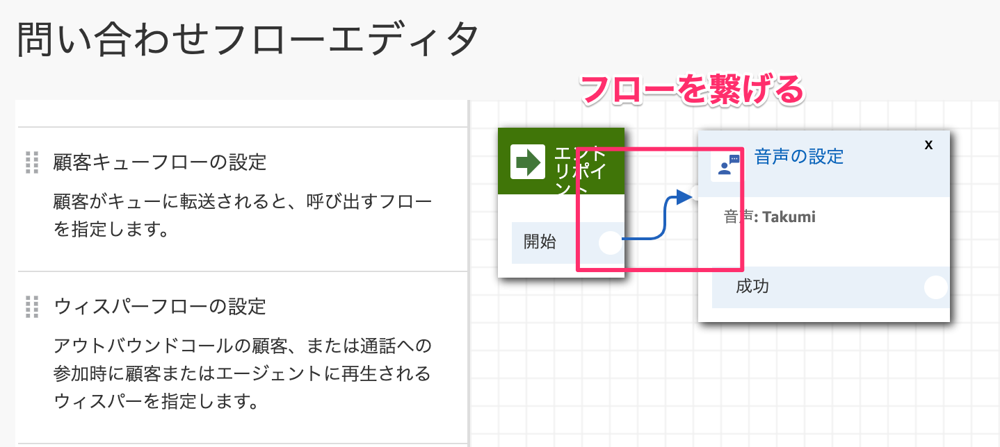

# Amazon Connectハンズオン 2019-05-21

## リソースを作成する
### 1-1. リソースを作成する
AWSにアクセスし、お持ちのAWSアカウントでログインします。  
[https://aws.amazon.com/jp/](https://aws.amazon.com/jp/)

コンソール画面が開いたら、サービス検索から【Amazon Connect】と入力して検索します。
出てきた［Amazon Connect］をクリックします。


［今すぐ始める］ボタンをクリックします。


東京リージョンになっているか確認してください。
なっていない方は右上から「**アジアパシフィック（東京）**」を選択します。


※既にリソースをお持ちの方は［インスタンスを追加する］ボタンを押して今回作成する専用のインスタンスを作成してください。


アクセスURLに今回使用するための名前を決めます。

［handson-ac-{今日の日付}-{連番}］という感じで他の人と被らないような名前にします。


ステップ２の管理者の作成は後でできるので、「これをスキップ」を選択してから、［次のステップ］ボタンをクリックします。


ステップ３のテレフォニーオプションもそのまま何もせず［次のステップ］ボタンをクリックします。


ステップ４のデータストレージもそのまま［次のステップ］ボタンをクリックします。


ステップ５で最終確認をして問題なければ［インスタンスの作成］ボタンをクリックします。


1〜2分ほど作成に時間がかかります。


成功すれば、［今すぐ始める］ボタンをクリックします。


## 電話番号を取得しよう！

### 2-1.電話番号を取得する
Amazon Connect専用の電話番号を手に入れます。
別のタブでAmazon Connect用の画面が表示されるので、そこに表示されている［今すぐ始める］ボタンをクリックします。


電話番号の取得で、国は`Japan +81`を選択します。


次のタイプは2種類あります。お好きな方を選んでください。

| タイプ       |       特徴 |
|:-----------------|:------------------|
| Direct Dial             | 050番号が取得できる。発信者が通話料負担する。 |
| Toll Free             | 0800番号が取得できる。発信者の通話料無料（フリーダイヤル）開発者が負担する。 |


最後にお好きな番号を選択して、［次へ］ボタンをクリックします。


［Continue］ボタンをクリックします。


### 2-2.取得した電話番号を確認する
取得した電話番号を確認します。
左メニューからルーティングの電話番号をクリックします。


取得した電話番号が表示されています。別の番号を増やしたい場合は右側にある［電話番号の追加］ボタン押して追加することもできます。


## オペレーターを設定しよう！

### 3-1.キューを設定する
キューは同時に同じ番号にかかってきた際にオペレーターが空いたら繋がるようにする待機スペースのようなものです。

左メニューのルーティングからキューをクリックします。


［新しいキューの追加］をクリックします。


それぞれ項目を埋めていき、［新しいキューの追加］ボタンをクリックします。

| 項目       |       値 |
|:-----------------|:------------------|
| 名前             | 営業部キュー |
| 説明             | 営業部のキュー |
| オペレーション時間             | Basic Hours |
| アウトバウンド発信者ID番号      | 取得した番号を指定 |


### 3-2.ルーティングプロファイルを設定する
キューで対応するべき部屋ができたので、次はルーティングプロファイルを作成します。
ルーティングプロファイルはどのキューに来たら、どのオペレーターに繋げるのかを橋渡しする役目があります。

左メニューのユーザーからルーティングプロファイルをクリックします。


［新しいプロファイルを追加］ボタンをクリックします。


それぞれ項目を埋めていき、［新しいプロファイルの追加］ボタンをクリックします。

| 項目       |       値 |
|:-----------------|:------------------|
| 名前             | 営業部プロファイル |
| 説明             | 営業部のプロファイル|
| ルーティングプロファイルのキュー | 営業部キュー |
| デフォルトのアウトバウンドキュー | 営業部キュー |


これで新しいプロファイルが作成されました。


### 3-3.オペレーターを作成する
次に電話対応するオペレーターを作成していきます。
左メニューのユーザーからユーザー管理をクリックします。


［新しいユーザーの追加］ボタンをクリックします。


作成を選択状態にして［次へ］ボタンをクリックします。


ユーザーの詳細情報を埋めていきます。埋めたら［保存］ボタンをクリックします。

| 項目       |       値 |
|:-----------------|:------------------|
|名|太郎|
|性|営業|
|ログイン名|eigyo|
|パスワード|お好きなパスワード|
|ルーティングプロファイル|営業部プロファイル|
|セキュリティプロファイル|Agent|


［ユーザーの作成］ボタンをクリックします。


## 問い合わせフローを作成しよう！

### 4-1.問い合わせフローを作成する
左メニューのルーティングから問い合わせフローをクリックします。


［問い合わせフローの作成］ボタンをクリックします。


問い合わせフローの名前を最初に設定しておきます。今回は **デモフロー** としました。


### 4-2.フローエディタに触れる
フローエディタを触っていきます。

左メニューの設定カテゴリを展開して、その中にある「音声の設定」をフローエディタにドラッグアンドドロップします。ドロップしたメニューをクリックします。


音声の設定で、言語は**日本語**を選択します。


音声は男性の声なら`Takumi`で女性の声なら`Mizuki`を選択します。お好きな方を選択してください。右下の［Save］ボタンをクリックします。


ブロックを繋いでいきます。エントリポイントの右にある○をクリックして引っ張ります。
そのまま出っ張っている部分に繋ぎます。
直感的に繋いていけるので初心者でも簡単に作ることができます。



操作カテゴリにあるプロンプトの再生ブロックをフローエディタにドラッグアンドドロップします。ドロップしたら、そのブロックをクリックします。


テキスト読み上げ機能（アドホック）を選択し、テキストを入力します。

```
<speak>
  <break time='2s' />
  お電話ありがとうございます。アイエンターでございます。
</speak>
```

解釈する部分はプルダウンメニューから`SSML`を選択します。最後に［Save］ボタンをクリックします。


ブロックを繋いでいきます。


### 4-3.IVRを設定する

コールセンターにもあるIVRという機能を実装します。これはユーザーからの番号を受け付けるものです。番号を押してもらい目的のメニューに誘導するための機能です。

操作カテゴリの顧客の入力を取得するブロックをフローエディタにドラッグアンドドロップします。ドロップしたら、そのブロックをクリックします。


テキスト読み上げ機能（アドホック）を選択して、テキストを入力します。

```
営業部に関するお問い合わせは１を、それ以外の方は２を押してください
```


下にスクロールして、［別の条件の追加］をクリックします。


オプションに数字の「1」を入力します。更に［別の条件の追加］をクリックします。


数字の「2」を入力して、右下の［Save］ボタンをクリックします。


ブロックを線で繋いでいきます。


### 4-4.オペレーターに繋げる
設定にあるキューの設定ブロックをフローエディタにドラッグアンドドロップします。営業部とそれ以外用のキューの2箇所ドラッグアンドドロップします。上の方のブロックをクリックします。


キューの選択から「営業部キュー」を選択し、右下の［Save］ボタンをクリックします。


次に下側のキューを設定します。ブロックをクリックします。


キューの選択から「BasicQueue」を選択して、［Save］ボタンをクリックします。


それぞれ2つのブロックを繋いでいきます。IVRで選択した番号に対応したところに紐づけていきます。


終了/転送カテゴリにあるキューへの転送ブロックをドラッグアンドドロップします。


成功側の線を繋ぎます。


キューへ転送したら、電話を終話したいので、
終了/転送カテゴリの切断ブロックをドラッグアンドドロップします。


それ以外の空いている項目は全て切断ブロックに繋げます。


全て繋ぎ終われば、右上の保存ボタンの横にある▼マークをクリックして、メニューを展開します。そのメニューの中に［保存して発行］をクリックします。

保存するだけでは、Amazon Connect側には反映されないので、必ず［保存して発行］をクリックします。


ポップアップが表示されるので、［保存して発行］ボタンをクリックします。


## キューの待ち音楽を設定しよう

### 5-1.キューの待ち音楽を設定する

左メニューのルーティングから問い合わせフローをクリックします。


［Default customer queue］をクリックします。


既にあるプロンプトのループブロックをクリックします。


Text to Speechの左にある「x」を押して削除し、右下の［Save］ボタンをクリックします。


［保存して発行］をクリックします。


## 問い合わせフローを適用しよう！

### 6-1.問い合わせフローを適用する
これまでに作成した問い合わせフローを電話番号に適用します。
左メニューのルーティングから電話番号をクリックします。


対象の電話番号をクリックします。


問い合わせフロー/IVRに今回作成した「デモフロー」を指定します。


右上のドアアイコンをクリックして、ログアウトします。


3-3で作成したオペレーターのユーザー名とパスワードでログインします。


ログインしたら電話アイコンをクリックします。


［次に設定：Available］を設定します。


利用可能状態にステータスを変更しておきます。


この状態で取得した電話番号にお手持ちの携帯電話から電話をかけると繋がります。
電話番号の入力を間違えないように気をつけてください。

うまくいけば、「お電話ありがとうございます。アイエンターでございます。」という音声が再生され、営業部なら1をそれ以外なら2をというように再生されます。

携帯電話のキーパッドを開いて、数字の［１］を押してください。
するとソフトフォンでPCに電話がかかってきます。

［通話を受信］ボタンをクリックすると電話に出られます。


